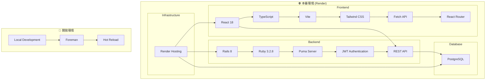

# Backpackers App

バックパッカーのための旅行情報共有アプリケーション

## 🏗️ 技術スタック（本番環境：Render 単体構成）



## 🚀 開発環境の起動

```bash
# 開発環境を起動
npm run up
# または
foreman start -f Procfile.dev

# 開発環境を停止（Ctrl+C または）
npm run down
```

## 📝 開発ルール

- POST/PATCHで送るときは必ずキー付きでラップする